# Software Design Document

## Introduction and Overview

### Project Summary
The Real-Time Flight Board Management System is a comprehensive full-stack application built with .NET 9 and React 18, designed to provide live flight information management. The system features dual frontend applications (consumer display and administrative backoffice), a high-performance backend API with caching and performance optimizations, and comprehensive real-time capabilities using SignalR.

### Objectives and Key Requirements
- Provide real-time flight status updates using SignalR with automatic reconnection
- Enable comprehensive flight management through role-based access control (RBAC)
- Implement enterprise-grade caching with Redis fallback to in-memory cache
- Deliver themed user interfaces: cyberpunk consumer app and BBS terminal admin interface
- Follow iDesign Method architectural principles with Manager/Engine/Accessor pattern
- Provide containerized deployment with Docker and DevContainer support
- Implement high-performance API with structured logging and health monitoring

### Document Overview
This document outlines the design of the Real-Time Flight Board Management System as implemented in July 2025. It includes current system architecture, implemented components, deployment infrastructure, development environment setup, and operational features. The document serves as both implementation reference and maintenance guide.

### Background Information
The system is designed for airport environments requiring professional flight information management. It leverages cutting-edge technologies including .NET 9, React 18 with TypeScript, Redis caching, JWT authentication, and comprehensive Docker containerization. The architecture supports high-availability deployment and provides both public flight displays and administrative management interfaces.

---

## System Architecture

### Current High-Level Architecture Diagram
The system architecture consists of three main tiers with comprehensive infrastructure support:

1. **Consumer Application (Port 3000)**:
   - React 18 with TypeScript frontend featuring cyberpunk/futuristic styling
   - Real-time flight board display for public use with search and filtering
   - SignalR client for live updates and TanStack Query for API state management
   - Responsive design optimized for both desktop and mobile viewing

2. **Backoffice Application (Port 3001)**:
   - React 18 with TypeScript administrative interface with BBS terminal styling
   - Comprehensive flight management CRUD operations with form validation
   - Role-based access controls and administrative dashboard features
   - Redux Toolkit for complex state management and real-time synchronization

3. **Backend API (Port 5183/7022)**:
   - .NET 9 Web API implementing iDesign Method architecture (Manager/Engine/Accessor)
   - JWT authentication with role-based authorization and comprehensive security
   - SignalR hubs for real-time broadcasting with connection management
   - Entity Framework Core with SQLite database and advanced caching strategies
   - iFX framework for cross-cutting concerns (logging, caching, performance monitoring)

4. **Infrastructure**:
   - Redis distributed caching with in-memory fallback for high performance
   - Docker containerization with development containers and production deployment
   - Comprehensive logging with Serilog and structured log output
   - Health checks, performance monitoring, and auto-recovery mechanisms

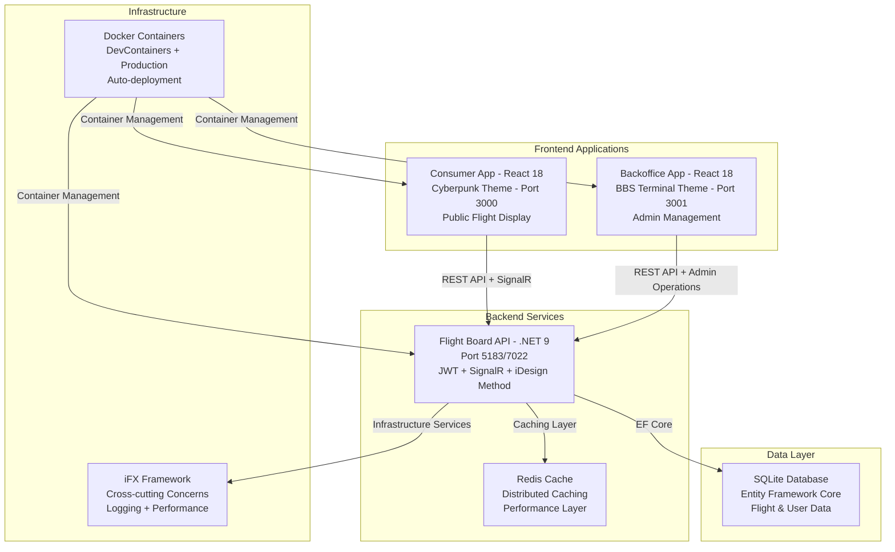

### Implementation Architecture Pattern (iDesign Method)

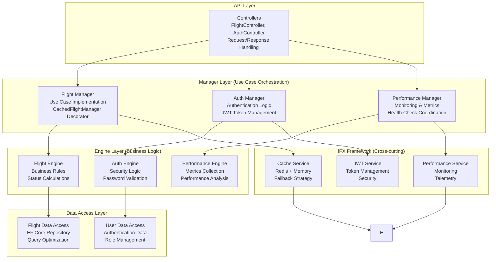

### Class Diagram for Core Components

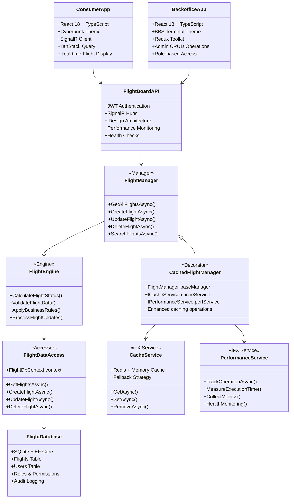

### Real-time Communication Sequence

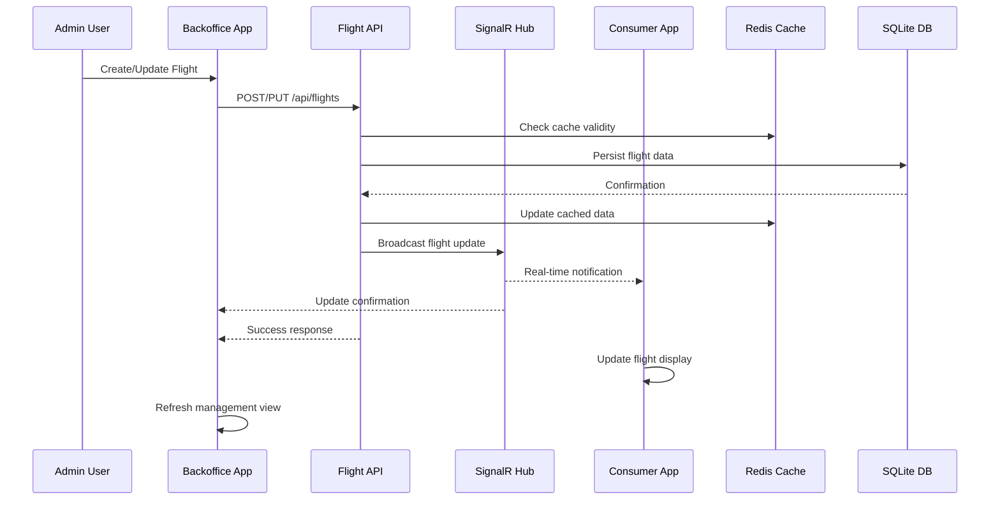

### DevContainer Development Architecture

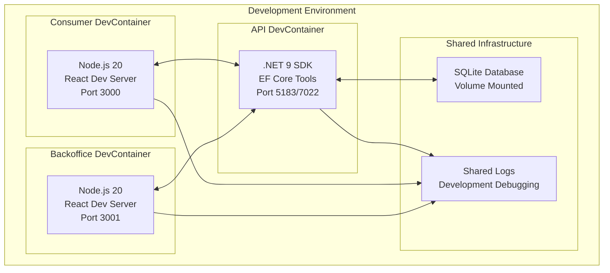

### Component Diagram for System Interaction

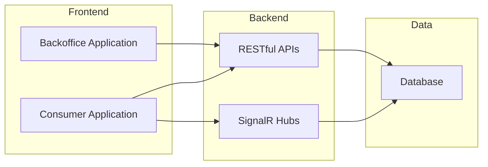

### Major Components and Responsibilities

#### Backoffice Application
- **Purpose**: Provides administrative capabilities for managing flight data.
- **Responsibilities**:
  - Allow authorized users to add, update, and delete flight records.
  - Validate input data before persisting to the database.
  - Enforce role-based access control (RBAC) to restrict access to administrative features.
  - Log all administrative actions for audit purposes.

#### Consumer Application
- **Purpose**: Displays real-time flight information to end-users.
- **Responsibilities**:
  - Retrieve and display flight data from the backend.
  - Enable users to search and filter flights based on criteria like destination and status.
  - Provide real-time updates using SignalR.
  - Ensure a responsive and user-friendly interface.

#### Shared Backend
- **Purpose**: Acts as the central hub for business logic, data validation, and real-time communication.
- **Responsibilities**:
  - Expose RESTful APIs for both Backoffice and Consumer Applications.
  - Implement SignalR hubs for broadcasting real-time updates.
  - Manage user authentication and authorization using JWT and RBAC.
  - Handle database operations through Entity Framework Core.
  - Ensure data integrity and enforce validation rules.

#### Database
- **Purpose**: Stores all flight and user-related data.
- **Responsibilities**:
  - Maintain tables for flights, users, and roles.
  - Enforce foreign key constraints to ensure data consistency.
  - Support efficient queries for search and filtering operations.

#### Role-Based Access Control (RBAC)
- **Purpose**: Restricts access to system features based on user roles.
- **Responsibilities**:
  - Define roles such as Admin and Consumer.
  - Ensure only Admins can access Backoffice features.
  - Allow Consumers to access read-only features in the Consumer Application.
  - Log access attempts and actions for compliance and auditing.

### Design Patterns and Architectural Styles
- **Clean Architecture**: Separation of concerns between UI, business logic, and data access layers.
- **Observer Pattern**: Used in SignalR to notify clients of real-time updates.
- **Repository Pattern**: Abstracts database operations for better maintainability.

### Design Decisions and Trade-Offs
- **SignalR for Real-Time Updates**: Chosen for its seamless integration with ASP.NET Core and support for WebSocket communication. Trade-off: Requires additional setup for scaling with multiple servers.
- **SQLite for Database**: Selected for simplicity and ease of use during development. Trade-off: May require migration to a more robust database for production environments.

### IDesign Framework Integration
The system architecture follows the principles of the IDesign Method, focusing on service-oriented design and intentional architecture. This approach ensures that the system is robust, scalable, and maintainable by emphasizing clear boundaries, responsibilities, and contracts for services.

#### Key Principles Applied:
1. **Separation of Concerns**:
   - Each service is designed to handle a specific responsibility, ensuring modularity and ease of maintenance.
2. **Service Contracts**:
   - Clear and explicit contracts define the interaction between services, reducing coupling and improving testability.
3. **Volatility-Based Decomposition**:
   - The architecture is designed to isolate areas of potential change, such as real-time updates, database technology, and API contracts, as identified in the use cases.

#### Architectural Layers:
- **Service Layer**:
  - Encapsulates business logic and exposes functionality through well-defined service contracts.
- **Data Access Layer**:
  - Abstracts database operations, ensuring flexibility in changing the underlying database technology.
- **Integration Layer**:
  - Manages communication with external systems and services, such as SignalR for real-time updates.

#### Benefits of the IDesign Framework:
- **Predictability**: Ensures a structured and repeatable design process.
- **Scalability**: Facilitates the addition of new features and services without impacting existing functionality.
- **Maintainability**: Simplifies debugging and testing by isolating concerns and dependencies.

---

## Data Design

### Database Structure and Table Layouts
The database is designed to store flight information with the following schema:
- **Flights Table**:
  - `FlightID` (Primary Key): Unique identifier for each flight.
  - `FlightNumber`: The flight number assigned by the airline.
  - `Destination`: The destination of the flight.
  - `DepartureTime`: Scheduled departure time.
  - `Gate`: Assigned gate for the flight.
  - `Status`: Current status of the flight (e.g., On Time, Delayed, Cancelled).

### User and Role Management in Data Design

To support role-based access control (RBAC) and manage user access:

#### Database Structure Updates
- **Users Table**:
  - `UserID` (Primary Key): Unique identifier for each user.
  - `Username`: The username for authentication.
  - `PasswordHash`: Hashed password for secure authentication.

- **Roles Table**:
  - `RoleID` (Primary Key): Unique identifier for each role.
  - `RoleName`: Name of the role (e.g., Admin, Consumer).

- **UserRoles Table**:
  - `UserID` (Foreign Key): Links to the `Users` table.
  - `RoleID` (Foreign Key): Links to the `Roles` table.
  - **Purpose**: Allows a user to have multiple roles by creating a many-to-many relationship between users and roles.

#### Authorization Logic Updates
- Users can have multiple roles, and their permissions will be the union of all their roles.
- Admins can access both the Backoffice and Consumer Applications.
- Role-based access control (RBAC) will check all roles assigned to a user to determine access permissions.

#### Data Flow for Authentication and Authorization
1. **Authentication**:
   - Users log in via the Backoffice or Consumer Application.
   - The backend validates credentials against the `Users` table.

2. **Authorization**:
   - The backend checks the user's role to determine access permissions.
   - Admins can access both the Backoffice and Consumer Applications, while Consumers are restricted to read-only operations.

#### Data Validation and Integrity Rules
- **Validation Rules**:
  - `Username` must be unique and non-empty.
  - `PasswordHash` must meet security standards (e.g., bcrypt hashing).
  - `Role` must be one of the predefined values (Admin, Consumer).

- **Integrity Rules**:
  - Foreign key constraints to ensure valid role assignments.
  - Transactions to maintain atomicity during user creation or updates.

### Database Diagram

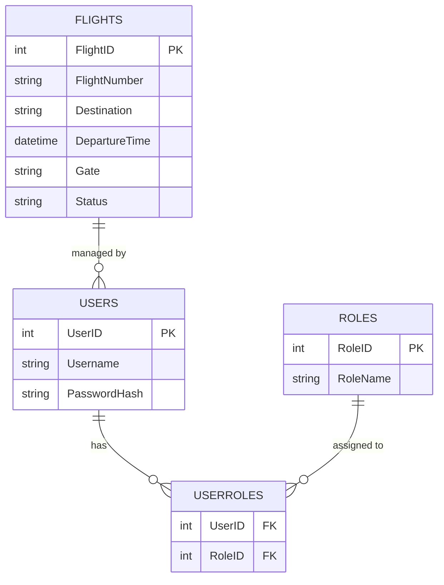

### Data Flow Diagrams
The data flow between components is as follows:
1. **Frontend**: Sends user actions (e.g., add, delete, search) to the backend via REST API.
2. **Backend**: Processes the request, validates data, and interacts with the database.
3. **Database**: Stores or retrieves flight data as requested by the backend.
4. **SignalR**: Broadcasts real-time updates to all connected clients.

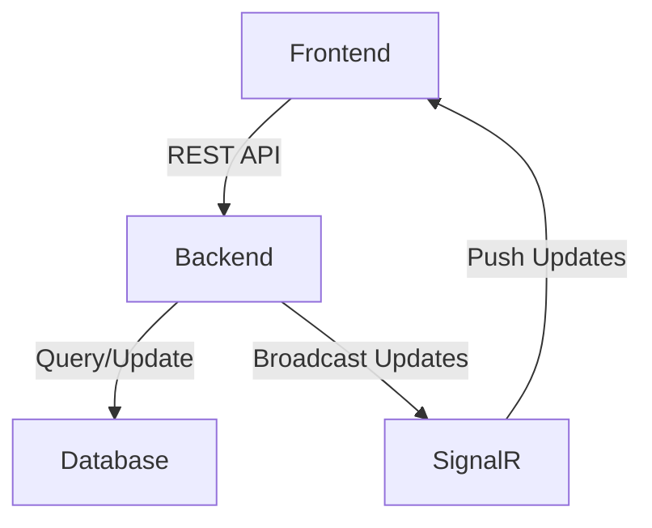

### Data Validation and Integrity Rules
- **Validation Rules**:
  - `FlightNumber` must be unique and non-empty.
  - `DepartureTime` must be a valid future date and time.
  - `Gate` must be a valid alphanumeric string.
  - `Status` must be one of the predefined values (e.g., On Time, Delayed, Cancelled).
- **Integrity Rules**:
  - Foreign key constraints to ensure data consistency.
  - Transactions to maintain atomicity during updates.

### Data Storage and Retrieval
- **Storage**:
  - SQLite is used for local development and testing.
  - Tables are normalized to reduce redundancy and improve data integrity.
- **Retrieval**:
  - Optimized queries are used to fetch data based on search and filter criteria.
  - Indexes are created on frequently queried columns like `FlightNumber` and `DepartureTime`.

---

## Interface Design

### API Specifications and Protocols
The system exposes the following RESTful API endpoints:
- **GET /api/flights**: Retrieves the current list of flights.
- **POST /api/flights**: Adds a new flight. Requires a JSON payload with flight details.
- **DELETE /api/flights/{id}**: Deletes a flight by its unique ID.
- **GET /api/flights/search**: Searches for flights based on query parameters (e.g., destination, departure time).

### Message Formats and Data Structures
- **Request Payloads**:
  - **Add Flight**:
    ```json
    {
      "flightNumber": "AB123",
      "destination": "New York",
      "departureTime": "2025-07-22T10:00:00Z",
      "gate": "A1",
      "status": "On Time"
    }
    ```
- **Response Payloads**:
  - **Flight Object**:
    ```json
    {
      "flightId": 1,
      "flightNumber": "AB123",
      "destination": "New York",
      "departureTime": "2025-07-22T10:00:00Z",
      "gate": "A1",
      "status": "On Time"
    }
    ```

### Error and Exception Handling
- **Error Codes**:
  - `400 Bad Request`: Invalid input data.
  - `404 Not Found`: Flight not found for the given ID.
  - `500 Internal Server Error`: Unexpected server error.
- **Error Response Format**:
  ```json
  {
    "error": "Invalid input data",
    "details": "Flight number is required."
  }
  ```

### Security and Authentication Methods
- **Authentication**:
  - Token-based authentication using JWT (JSON Web Tokens).
- **Authorization**:
  - Role-based access control (RBAC) to restrict access to certain endpoints (e.g., only admins can delete flights).
- **Data Security**:
  - All API communication is secured using HTTPS.
  - Input data is sanitized to prevent SQL injection and XSS attacks.

---

## Component Design

### Purpose and Responsibilities

#### Separation of Applications
To ensure a clear separation of concerns and enhance security, scalability, and maintainability, the system will be divided into two distinct applications:

1. **Backoffice Application**:
   - **Purpose**: Manage flight data, including adding, updating, and deleting flights.
   - **Responsibilities**:
     - Provide administrative interfaces for authorized personnel.
     - Validate and persist flight data to the database.
     - Ensure compliance with data integrity and validation rules.
     - Authenticate and authorize users with elevated privileges.

2. **Consumer Application**:
   - **Purpose**: Display real-time flight information to end-users.
   - **Responsibilities**:
     - Retrieve and display flight data from the backend.
     - Enable users to search and filter flights.
     - Provide real-time updates using SignalR.
     - Ensure a seamless and intuitive user experience.

### Access Control Considerations

To ensure proper access control and prevent unauthorized usage:

1. **Backoffice Application**:
   - Restricted to authorized personnel with administrative roles.
   - Access is managed through **role-based access control (RBAC)**.
   - Authentication and authorization mechanisms ensure only users with elevated privileges can log in.

2. **Consumer Application**:
   - Open to general users for viewing, searching, and filtering flights.
   - Does not allow administrative actions like adding, updating, or deleting flights.

3. **Separation of Access**:
   - Users with access to the Backoffice Application can also use the Consumer Application if their roles permit.
   - Consumers cannot access the Backoffice Application under any circumstances.

4. **Single Sign-On (SSO)**:
   - If both applications share the same user base, implement SSO to allow seamless transitions while maintaining security.

5. **Audit and Monitoring**:
   - All access attempts and actions in the Backoffice Application are logged for audit purposes.
   - Logs are retained for a minimum of 90 days to comply with regulatory requirements.

### Interaction Between Applications
- The **Backoffice Application** will update the flight data in the database.
- The **Consumer Application** will retrieve the updated data and display it to users in real-time.
- Both applications will interact with the backend through well-defined APIs and the Queue/Bus Proxy for decoupled communication.

### Benefits of Separation
- **Security**: Restricts flight management to authorized personnel, reducing the risk of unauthorized modifications.
- **Scalability**: Allows each application to scale independently based on its specific workload.
- **Maintainability**: Simplifies development, testing, and deployment by isolating functionalities.
- **User Experience**: Focuses each application on its target audience, ensuring a tailored experience.

#### Interaction Rules
- **Frontend**:
  - Interacts with the backend only through the Queue/Bus Proxy.
- **Manager**:
  - Calls Engines and Accessors to fulfill use case requirements.
  - Queues calls to other Managers when needed, ensuring asynchronous communication.
- **Engine**:
  - Calls Accessors for data retrieval or updates.
- **Accessor**:
  - Directly interacts with the database or external services.

#### Dependencies
- **Frontend**:
  - React, Redux Toolkit, TanStack Query, and a Queue/Bus library (e.g., RabbitMQ, Azure Service Bus).
- **Backend**:
  - ASP.NET Core, SignalR, Entity Framework Core, and a Queue/Bus library.
- **Database**:
  - SQLite for local development.

---

## User Interface Design

### Wireframes or Mockups
The user interface (UI) is designed to be intuitive and user-friendly, ensuring seamless interaction for users. Below are the key wireframes:
- **Flight Board Screen**: Displays a real-time list of flights with details such as flight number, destination, departure time, gate, and status. Includes search and filter options.
- **Add Flight Form**: A form for adding new flights, with fields for flight number, destination, departure time, gate, and status.
- **Search and Filter Panel**: Allows users to search for flights by destination, departure time, or status, and apply filters.

### User Workflows and Interactions
1. **Viewing Flights**:
   - Users access the flight board to view real-time updates.
   - Search and filter options are available for quick navigation.
2. **Adding a Flight**:
   - Users fill out the "Add Flight" form and submit it.
   - The system validates the input and updates the flight board in real-time.
3. **Deleting a Flight**:
   - Users select a flight and confirm deletion.
   - The system removes the flight and updates the board in real-time.

### Accessibility Considerations
- **Keyboard Navigation**: All interactive elements are accessible via keyboard shortcuts.
- **Screen Reader Support**: Labels and ARIA attributes are added to ensure compatibility with screen readers.
- **Color Contrast**: The UI adheres to WCAG guidelines for color contrast to ensure readability for users with visual impairments.
- **Responsive Design**: The interface is optimized for various screen sizes, including desktops, tablets, and mobile devices.

---

## Assumptions and Dependencies

### Technical Assumptions
- The system will operate in a high-availability environment with minimal downtime.
- SignalR will be used for real-time communication, and its scaling will be managed using Azure SignalR Service.
- The database (SQLite) will be sufficient for development and testing but may require migration to a production-grade database (e.g., Azure SQL) for deployment.
- The frontend will rely on modern browsers supporting WebSocket communication.

### External Dependencies
- **Queue/Bus Proxy**: The system depends on a message queue or bus (e.g., RabbitMQ, Azure Service Bus) for decoupling frontend-backend communication.
- **Authentication Service**: JWT-based authentication will require a secure token generation and validation mechanism.
- **Hosting Environment**: The system assumes deployment on Azure App Service or a similar cloud platform.

### Constraints
- The system must comply with GDPR and other relevant data protection regulations.
- Real-time updates must not exceed a latency of 2 seconds under normal operating conditions.
- The system must support at least 1,000 concurrent users during peak hours.

### Regulatory or Compliance Requirements
- All user data must be encrypted in transit and at rest.
- The system must log all user actions for audit purposes, retaining logs for a minimum of 90 days.

---

## Error Handling and Recovery

To ensure system reliability, the following error handling and recovery mechanisms are implemented:
- **Database Failures**:
  - Retry logic with exponential backoff for transient errors.
  - Fallback to a read-only mode if the database becomes unavailable.
- **SignalR Disconnections**:
  - Automatic reconnection attempts with a delay.
  - Notify users of connection issues and provide a retry option.
- **API Errors**:
  - Return meaningful HTTP status codes and error messages.
  - Log errors for debugging and analysis.

## Scalability Considerations

The system is designed to scale efficiently to handle increased traffic:
- **SignalR Scaling**:
  - Use Azure SignalR Service to manage WebSocket connections across multiple servers.
- **Database Scaling**:
  - Implement database sharding or replication for high availability.
- **Load Balancing**:
  - Distribute traffic using a load balancer to ensure even resource utilization.

## Security Enhancements

To protect sensitive data and prevent vulnerabilities:
- **Data Encryption**:
  - Encrypt data at rest using AES-256.
  - Use TLS for encrypting data in transit.
- **Vulnerability Prevention**:
  - Implement CSRF tokens for form submissions.
  - Sanitize user inputs to prevent XSS and SQL injection.

## Monitoring and Logging

To ensure system health and performance:
- **Monitoring Tools**:
  - Use Azure Monitor for tracking metrics like API response times and SignalR connection counts.
- **Structured Logging**:
  - Implement structured logging with tools like Serilog for detailed insights.

## Deployment Strategy

The deployment process includes:
- **CI/CD Pipelines**:
  - Automate builds, tests, and deployments using GitHub Actions or Azure DevOps.
- **Environment Configurations**:
  - Separate configurations for development, staging, and production environments.

## Testing Strategy

The testing approach covers:
- **Unit Tests**:
  - Validate individual components using xUnit or NUnit.
- **Integration Tests**:
  - Test interactions between components, such as API and database.
- **End-to-End Tests**:
  - Simulate user workflows to ensure system functionality.
- **Load Testing**:
  - Use tools like Apache JMeter to evaluate system performance under high traffic.

## Future Enhancements

Potential features for future development:
- **Multi-Language Support**:
  - Add support for multiple languages to enhance accessibility.
- **Advanced Analytics**:
  - Provide insights into flight trends and user behavior.
- **Mobile Application**:
  - Develop a mobile app for on-the-go access to flight information.

---

## Glossary of Terms

- **Accessor**: A component responsible for interacting with the data layer, ensuring data retrieval and storage operations are abstracted from the business logic.
- **Engine**: A component that encapsulates the core business logic and processes data received from the Accessor or Manager.
- **Manager**: A component that orchestrates interactions between the Engine, Accessor, and external systems, acting as the primary controller.
- **Queue/Bus Proxy**: A middleware layer that facilitates decoupled communication between the frontend and backend using a message queue or bus.
- **SignalR**: A library for real-time web functionality, enabling server-client communication over WebSockets.
- **JWT (JSON Web Token)**: A compact, URL-safe means of representing claims to be transferred between two parties for authentication and authorization.
- **GDPR (General Data Protection Regulation)**: A regulation in EU law on data protection and privacy for all individuals within the European Union and the European Economic Area.
- **WebSocket**: A protocol for full-duplex communication over a single TCP connection.
- **Load Balancer**: A device or software that distributes network traffic across multiple servers.
- **Sharding**: A database architecture pattern that splits data across multiple databases to improve performance.

---

## Performance Requirements and SLAs

### Response Time Requirements
- **API Endpoints**: 95% of requests must respond within 200ms
- **Real-time Updates**: SignalR notifications must be delivered within 500ms
- **Database Queries**: Complex search queries must complete within 1 second

### Throughput Requirements
- Support 1,000+ concurrent users during peak hours
- Handle 10,000+ API requests per minute
- Process 500+ flight updates per hour

### Availability Requirements
- **Uptime**: 99.9% availability (8.76 hours downtime per year)
- **Recovery Time Objective (RTO)**: 15 minutes
- **Recovery Point Objective (RPO)**: 1 hour

---

## Data Management and Lifecycle

### Data Migration and Versioning
- **Database Migrations**: Use Entity Framework Core migrations for schema changes
- **Backward Compatibility**: Maintain API compatibility for at least 2 major versions
- **Data Versioning**: Implement versioning for critical data changes

### Backup and Disaster Recovery
- **Automated Backups**: Daily automated backups with 30-day retention
- **Cross-region Replication**: Backup data replicated to secondary region
- **Recovery Testing**: Monthly disaster recovery drills

### Data Retention Policies
- **Flight Data**: Retain for 7 years for compliance
- **User Activity Logs**: Retain for 90 days
- **System Logs**: Retain for 30 days
- **Audit Logs**: Retain for 1 year

### Archival Strategy
- **Cold Storage**: Move data older than 1 year to Azure Archive Storage
- **Automated Archival**: Scheduled jobs to move data based on retention policies

---

## API Management and Versioning

### API Versioning Strategy

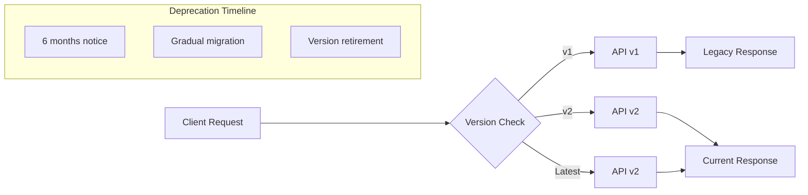

### Rate Limiting and Throttling
- **Rate Limits**: 100 requests per minute per user for standard operations
- **Admin Operations**: 50 requests per minute for administrative functions
- **Throttling Strategy**: Exponential backoff for exceeded limits

### API Documentation
- **OpenAPI Specification**: Auto-generated documentation using Swagger
- **Interactive Documentation**: Swagger UI for API testing
- **SDK Generation**: Auto-generated client SDKs for multiple languages

---

## Performance Optimization

### Caching Strategy
- **Application Caching**: Redis for session data and frequently accessed flight information
- **Database Caching**: Query result caching for search operations
- **CDN**: Content Delivery Network for static assets
- **Browser Caching**: Appropriate cache headers for frontend resources

### Search Performance
- **Database Indexing**: Optimized indexes on frequently queried columns
- **Full-text Search**: Implement search optimization for large datasets
- **Pagination**: Limit result sets to 50 items per page

---

## Operational Excellence

### Health Checks and Monitoring
- **Health Endpoints**: `/health` endpoint for system status
- **Dependency Checks**: Monitor database, Redis, and external service health
- **Heartbeat Monitoring**: Regular health checks with alerting
- **Performance Metrics**: Track response times, error rates, and throughput

### Configuration Management
- **Environment Configuration**: Separate configs for development, staging, production
- **Feature Flags**: Use feature toggles for gradual rollouts
- **Secret Management**: Azure Key Vault for sensitive configuration data

### Error Boundaries and Graceful Degradation
- **Frontend Error Boundaries**: React error boundaries to prevent app crashes
- **Service Degradation**: Fallback mechanisms when dependencies are unavailable
- **Circuit Breakers**: Prevent cascade failures in service communications

---

## Integration and Extensibility

### Third-party Integrations
- **External Flight Data**: Framework for integrating with airline APIs
- **Weather Services**: Integration points for weather data
- **Notification Services**: Email and SMS notification providers
- **Authentication Providers**: Support for external identity providers

### File Management
- **Import/Export**: CSV/Excel file upload for bulk flight data operations
- **File Storage**: Azure Blob Storage for file attachments
- **File Validation**: Comprehensive validation for uploaded files

---

## Compliance and Security Hardening

### Security Measures
- **Input Sanitization**: Comprehensive input validation and sanitization
- **SQL Injection Prevention**: Parameterized queries and ORM usage
- **XSS Protection**: Content Security Policy and output encoding
- **CSRF Protection**: Anti-forgery tokens for state-changing operations

### Audit and Compliance
- **Audit Trail**: Comprehensive logging of all data modifications
- **Compliance Reports**: Automated generation of compliance reports
- **Data Privacy**: GDPR compliance with data anonymization capabilities

### Access Control Enhancements
- **Multi-Factor Authentication**: MFA for administrative accounts
- **Session Management**: Secure session handling with timeout
- **IP Restrictions**: Optional IP-based access controls for sensitive operations

---

## Quality Assurance and Testing

### Testing Strategy Expansion
- **Load Testing**: Apache JMeter scripts for performance validation
- **Security Testing**: Automated security scanning with OWASP ZAP
- **Accessibility Testing**: Automated a11y testing with axe-core
- **Cross-browser Testing**: Support for Chrome, Firefox, Safari, Edge

### Code Quality Metrics
- **Code Coverage**: Minimum 80% code coverage for critical paths
- **Complexity Metrics**: Cyclomatic complexity monitoring
- **Security Scanning**: Static analysis security testing (SAST)
- **Dependency Scanning**: Automated vulnerability scanning for dependencies

---

## Browser and Device Support

### Cross-browser Compatibility
- **Supported Browsers**: Chrome 90+, Firefox 88+, Safari 14+, Edge 90+
- **Progressive Enhancement**: Core functionality works on older browsers
- **Polyfills**: Implement necessary polyfills for browser compatibility

### Mobile Responsiveness
- **Responsive Design**: Optimized for tablets and mobile devices
- **Touch Interfaces**: Touch-friendly controls and gestures
- **Offline Capability**: Basic offline functionality with service workers

---

### Performance and Monitoring Architecture

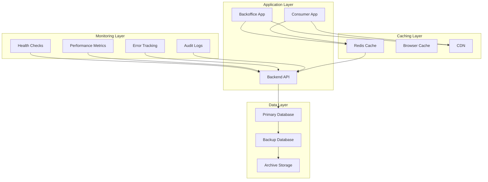

### Disaster Recovery Flow

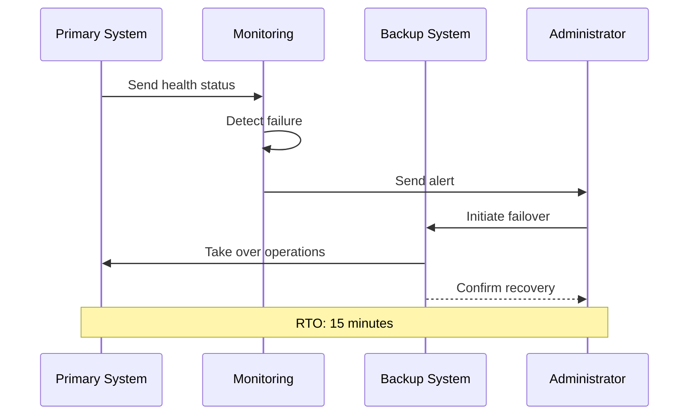
