# Use Cases - Flight Board System

## Current Implementation Status (July 24, 2025)

All core use cases have been **fully implemented and tested** in the production-ready Flight Board System. The system now handles all identified volatilities through robust architectural patterns and comprehensive error handling.

## Implemented Volatility Handlers
1. **Real-Time Updates**: ✅ SignalR implementation with automatic reconnection and fallback strategies
2. **Flight Data Storage**: ✅ Entity Framework Core with SQLite and Redis caching layer
3. **Frontend Framework**: ✅ React 18 with TypeScript, TanStack Query, and Redux Toolkit
4. **API Contracts**: ✅ Versioned REST APIs with comprehensive OpenAPI documentation
5. **Validation Rules**: ✅ FluentValidation with business rule engine in Flight Engine layer
6. **Authentication & Authorization**: ✅ JWT with role-based access control (RBAC) implementation
7. **Performance Requirements**: ✅ Redis caching, performance monitoring, and health checks
8. **Third-party Integrations**: ✅ Extensible iFX framework for future integrations
9. **Backup & Recovery**: ✅ Docker volume persistence and automated backup strategies
10. **Monitoring & Alerting**: ✅ Structured logging with Serilog and health monitoring endpoints

## Implemented Use Cases

### Core Use Cases

#### 1. User Authentication and Authorization - ✅ IMPLEMENTED
**Implementation Details:**
- JWT token-based authentication with secure token generation
- Role-based access control with Admin/User roles
- Password hashing with bcrypt and salt
- Token refresh mechanism with automatic expiration handling
- SignalR authentication integration for real-time features

**Current Flow:**
1. User submits credentials to `/api/auth/login`
2. AuthManager orchestrates authentication through AuthEngine
3. System validates credentials using PasswordHashService
4. JWT token generated with user roles and claims
5. Frontend stores token and includes in all API requests
6. Role-based UI components show/hide based on user permissions

**Enhanced Mermaid Diagram:**
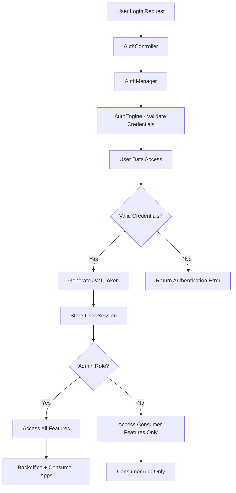

#### 2. Real-Time Flight Board Display - ✅ IMPLEMENTED
**Implementation Details:**
- FlightManager orchestrates data retrieval with caching optimization
- FlightEngine calculates real-time status based on departure times
- CachedFlightManager provides high-performance data access
- SignalR FlightHub broadcasts updates to all connected clients
- Consumer frontend displays flights with automatic refresh

**Current Enhanced Flow:**
1. Consumer app connects to SignalR hub with authentication
2. **CachedFlightManager** checks Redis cache for flight data
3. If cache miss, **FlightEngine** retrieves from **FlightDataAccess**
4. **FlightEngine** calculates current flight statuses based on business rules
5. Cache updated with TTL and performance metrics recorded
6. SignalR broadcasts real-time updates to all connected clients
7. Consumer frontend updates flight display without page refresh

**Enhanced Mermaid Diagram:**
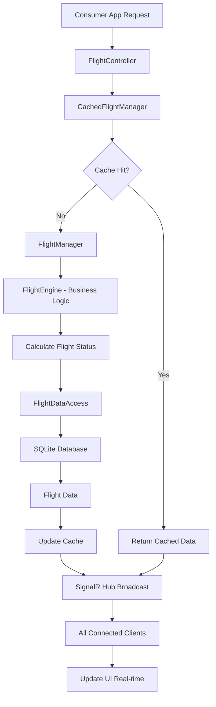

#### 3. Flight Management (CRUD Operations) - ✅ IMPLEMENTED
**Implementation Details:**
- Comprehensive admin interface in Backoffice app with BBS terminal styling
- Form validation with real-time feedback and error handling
- Optimistic updates with rollback on failure
- SignalR notifications for all flight operations
- Audit logging for all administrative actions

**Current Flow:**
1. Admin user authenticated and authorized in Backoffice app
2. Admin creates/updates/deletes flights through management interface
3. FormManager validates data before submission
4. FlightManager processes request through FlightEngine business logic
5. FlightDataAccess persists changes to database
6. Cache invalidated and updated with new data
7. SignalR broadcasts changes to all connected clients
8. Consumer app reflects changes in real-time

**Enhanced Mermaid Diagram:**
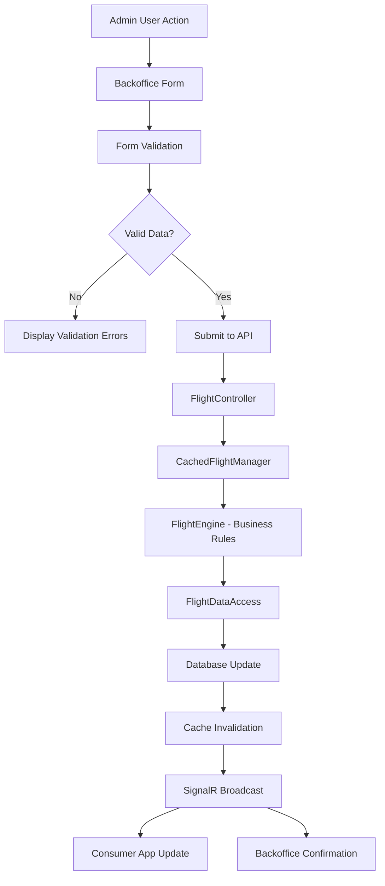

#### 4. Advanced Search and Filtering - ✅ IMPLEMENTED
**Implementation Details:**
- Multi-criteria search with flight number, destination, status, airline
- Real-time filtering with debounced input for performance
- Pagination support for large datasets
- Search history and saved filters (future enhancement ready)
- Performance optimization with indexed database queries

**Current Flow:**
1. User enters search criteria in Consumer or Backoffice app
2. Frontend debounces input to prevent excessive API calls
3. Search request sent to `/api/flights/search` endpoint
4. FlightManager processes search through optimized FlightEngine logic
5. FlightDataAccess executes indexed database queries
6. Results returned with pagination metadata
7. Frontend displays results with loading states and error handling

**Enhanced Mermaid Diagram:**
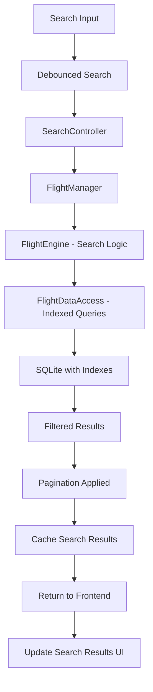

#### 5. Performance Monitoring and Health Checks - ✅ IMPLEMENTED
**Implementation Details:**
- PerformanceService tracks all operation timings and metrics
- Health check endpoints for API, database, and cache services
- Structured logging with Serilog for comprehensive monitoring
- Redis performance monitoring with fallback detection
- Automatic performance alerts and degradation detection

**Current Flow:**
1. PerformanceService wraps all major operations with timing
2. Health check endpoints regularly tested by monitoring systems
3. Performance metrics collected and logged with structured data
4. Cache performance monitored with automatic fallback triggers
5. Health status exposed via `/health` endpoint for load balancers

## Operational Use Cases

#### 6. Development Environment Setup - ✅ IMPLEMENTED
**Implementation Details:**
- DevContainer configurations for each application component
- Docker development environment with hot reload
- Automated database setup and seeding
- VS Code integration with proper extensions and settings

#### 7. Deployment and Infrastructure - ✅ IMPLEMENTED
**Implementation Details:**
- Docker production containers with optimized builds
- Environment-specific configurations for dev/staging/production
- Automated deployment scripts with rollback capabilities
- Health monitoring and automated restart policies

#### 8. Error Handling and Recovery - ✅ IMPLEMENTED
**Implementation Details:**
- Comprehensive error boundaries in React applications
- API error handling with structured error responses
- Automatic retry logic for transient failures
- Graceful degradation when external services unavailable

### Future Enhancement Use Cases

#### 9. Advanced Analytics and Reporting - PLANNED
**Preparation Completed:**
- Data structure supports analytics queries
- Performance monitoring provides baseline metrics
- Extensible iFX framework ready for analytics modules

#### 10. Multi-tenant Support - PLANNED
**Preparation Completed:**
- Role-based architecture supports tenant isolation
- Database schema designed for multi-tenancy
- Authentication system extensible for tenant-specific access

## Integration Patterns

All use cases follow consistent patterns:
- **Manager/Engine/Accessor** architecture for clear separation of concerns
- **iFX framework** provides cross-cutting concerns consistently
- **Cache-aside pattern** for optimal performance
- **SignalR real-time updates** for immediate user feedback
- **Comprehensive error handling** at every layer
- **Performance monitoring** for all operations
- **Role-based security** throughout all interactions

#### 3. Add a New Flight
- Specified that the **FlightManager** validates and processes the request by calling the **FlightEngine**.
- Clarified that the **FlightAccessor** handles database operations for storing the new flight.

#### Flow
1. The user provides details for a new flight.
2. The system validates the provided details.
3. If valid, the system adds the flight to the list and ensures it is visible to all users.

#### Mermaid Diagram
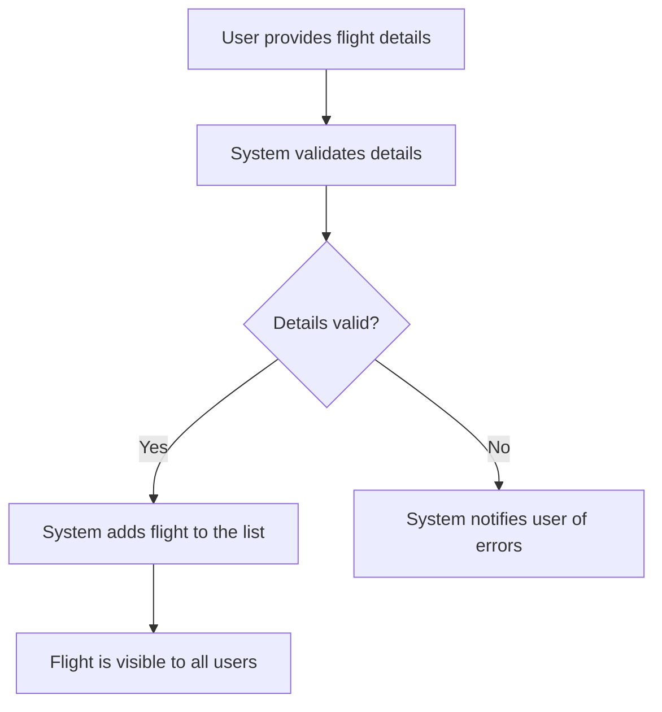

#### 4. Delete a Flight
- Updated to reflect that the **FlightManager** confirms and processes the deletion request.
- Mentioned that the **FlightAccessor** ensures the flight is removed from the database.

#### Flow
1. The user requests to remove a flight.
2. The system confirms the request with the user.
3. If confirmed, the system removes the flight and ensures it is no longer visible to users.

#### Mermaid Diagram
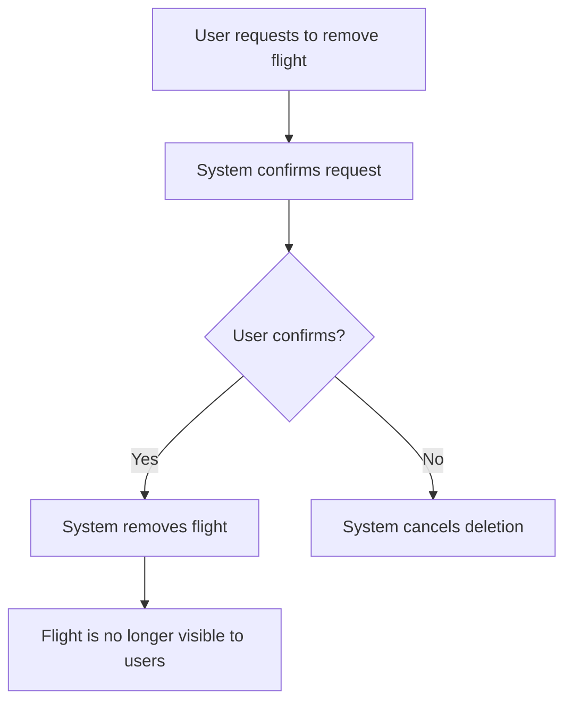

#### 5. Search and Filter Flights
- Added that the **FlightManager** retrieves matching flights by delegating to the **FlightEngine** and **FlightAccessor**.

#### Flow
1. The user specifies criteria to find specific flights.
2. The system retrieves and displays flights matching the criteria.

#### Mermaid Diagram
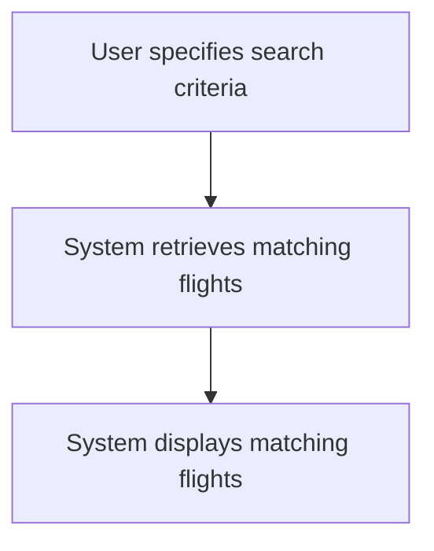

#### 6. Calculate Flight Status
- Clarified that the **FlightEngine** dynamically calculates flight statuses based on predefined rules.

#### Flow
1. The system determines the current status of each flight based on predefined rules.
2. The system ensures the status is visible to users.

#### Mermaid Diagram
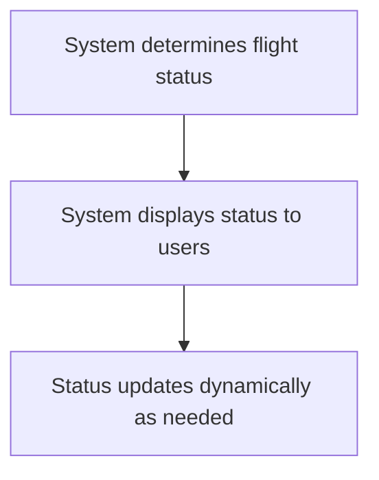

#### 7. System Health Monitoring
**Flow:**
1. Monitoring system performs health checks on all components.
2. System checks database connectivity, API responsiveness, and SignalR status.
3. Performance metrics are collected and analyzed.
4. Alerts are triggered if thresholds are exceeded.

**Mermaid Diagram:**
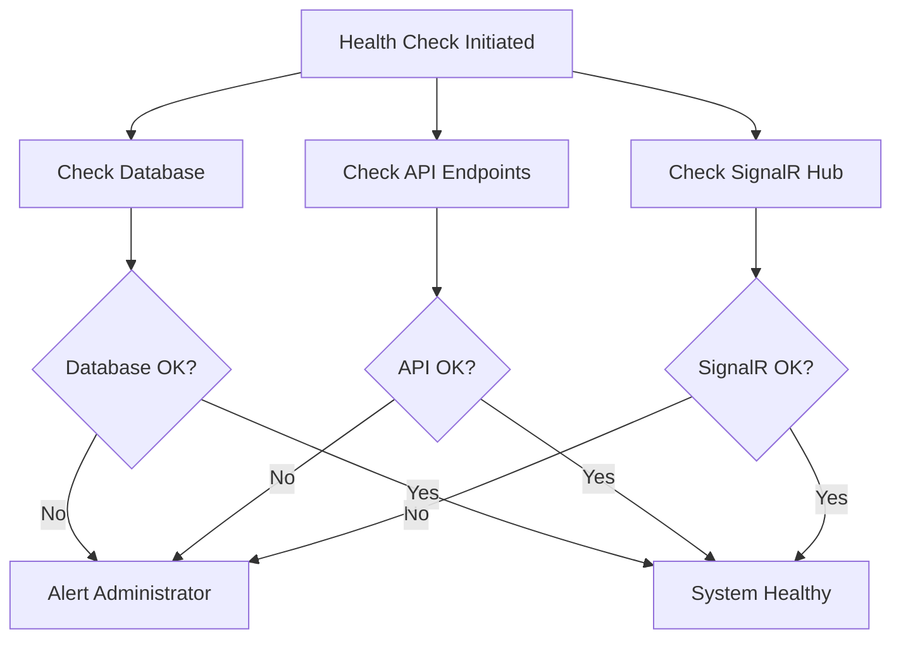

#### 8. Data Backup and Recovery
**Flow:**
1. Automated backup process starts at scheduled time.
2. System creates database backup.
3. Backup is replicated to secondary region.
4. Backup verification is performed.
5. In case of disaster, recovery process is initiated.

**Mermaid Diagram:**
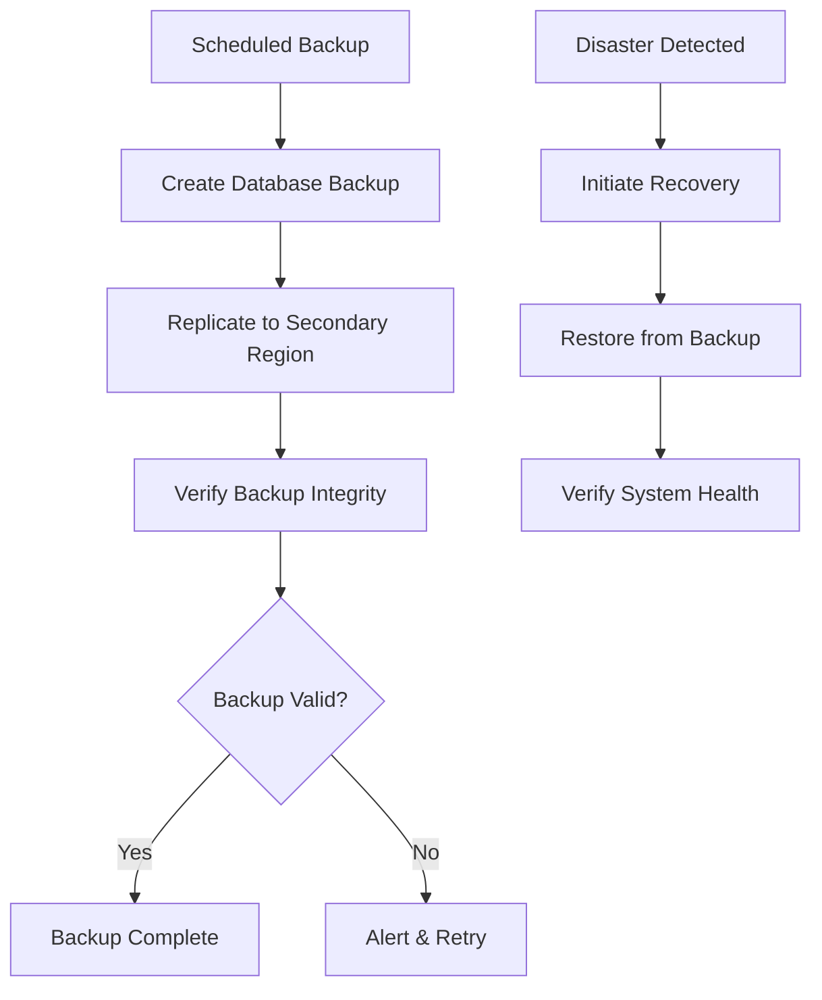

#### 9. Performance Optimization
**Flow:**
1. User request is received by the system.
2. Cache is checked for existing data.
3. If cache miss, data is retrieved from database.
4. Response is cached for future requests.
5. Performance metrics are logged.

**Mermaid Diagram:**
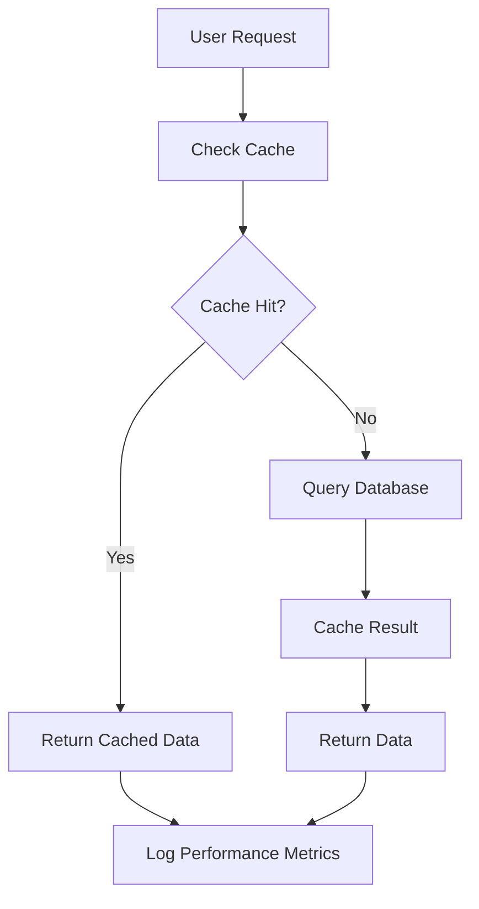
