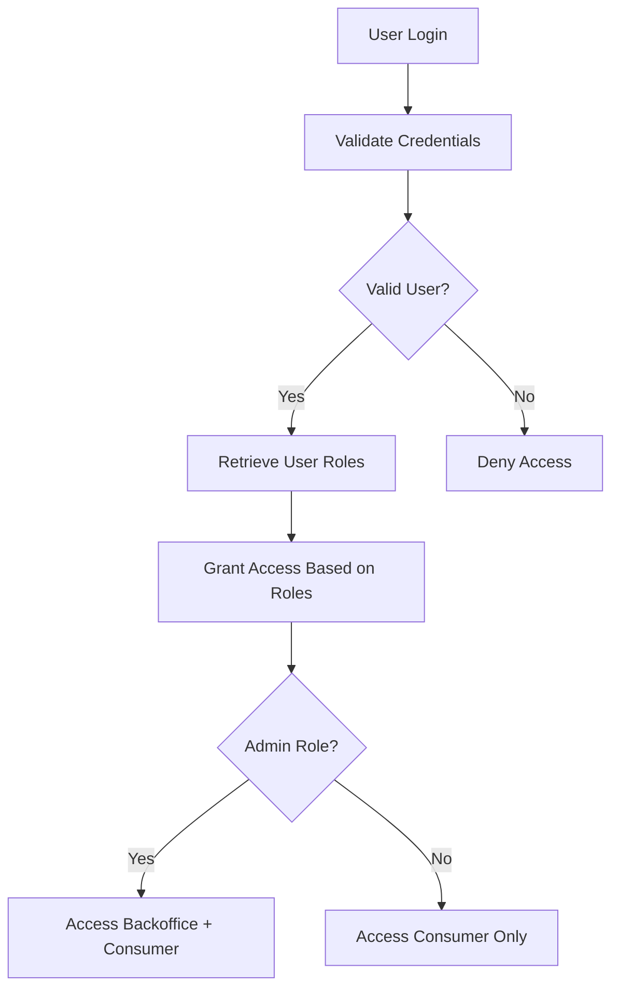
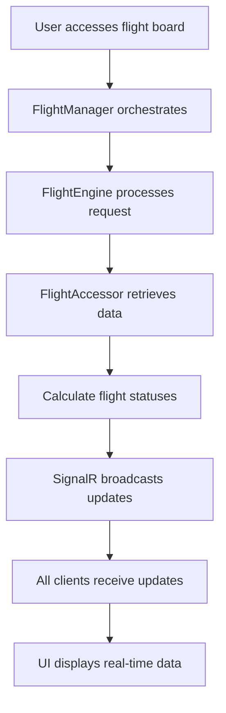

# Use Cases

## Identified Volatilities
1. **Real-Time Updates**: Changes in how real-time updates are handled (e.g., SignalR implementation).
2. **Flight Data Storage**: Potential changes in database technology or schema.
3. **Frontend Framework**: Updates to React or state management libraries.
4. **API Contracts**: Modifications to API endpoints or data structures.
5. **Validation Rules**: Changes in business rules for flight validation.
6. **Authentication & Authorization**: Changes in user roles and access control mechanisms.
7. **Performance Requirements**: Changes in SLA requirements and performance metrics.
8. **Third-party Integrations**: Changes in external service APIs and data sources.
9. **Backup & Recovery**: Changes in data retention and disaster recovery policies.
10. **Monitoring & Alerting**: Changes in monitoring tools and alerting mechanisms.

## Use Cases

### Core Use Cases

#### 1. User Authentication and Authorization
**Flow:**
1. User attempts to access the system (Backoffice or Consumer Application).
2. System validates user credentials against the Users table.
3. System retrieves user roles from UserRoles table.
4. System grants appropriate access based on role permissions.

**Mermaid Diagram:**

#### 2. Display Real-Time Flight Board
**Updated Flow:**
1. Consumer accesses the flight board application.
2. **FlightManager** orchestrates data retrieval through **FlightEngine**.
3. **FlightAccessor** fetches flight data from the database.
4. System calculates real-time flight statuses.
5. SignalR broadcasts updates to all connected clients.
6. Frontend displays updated flight information.

**Enhanced Mermaid Diagram:**

#### 3. Add a New Flight
- Specified that the **FlightManager** validates and processes the request by calling the **FlightEngine**.
- Clarified that the **FlightAccessor** handles database operations for storing the new flight.

#### Flow
1. The user provides details for a new flight.
2. The system validates the provided details.
3. If valid, the system adds the flight to the list and ensures it is visible to all users.

#### Mermaid Diagram

#### 4. Delete a Flight
- Updated to reflect that the **FlightManager** confirms and processes the deletion request.
- Mentioned that the **FlightAccessor** ensures the flight is removed from the database.

#### Flow
1. The user requests to remove a flight.
2. The system confirms the request with the user.
3. If confirmed, the system removes the flight and ensures it is no longer visible to users.

#### Mermaid Diagram

#### 5. Search and Filter Flights
- Added that the **FlightManager** retrieves matching flights by delegating to the **FlightEngine** and **FlightAccessor**.

#### Flow
1. The user specifies criteria to find specific flights.
2. The system retrieves and displays flights matching the criteria.

#### Mermaid Diagram

#### 6. Calculate Flight Status
- Clarified that the **FlightEngine** dynamically calculates flight statuses based on predefined rules.

#### Flow
1. The system determines the current status of each flight based on predefined rules.
2. The system ensures the status is visible to users.

#### Mermaid Diagram

#### 7. System Health Monitoring
**Flow:**
1. Monitoring system performs health checks on all components.
2. System checks database connectivity, API responsiveness, and SignalR status.
3. Performance metrics are collected and analyzed.
4. Alerts are triggered if thresholds are exceeded.

**Mermaid Diagram:**

#### 8. Data Backup and Recovery
**Flow:**
1. Automated backup process starts at scheduled time.
2. System creates database backup.
3. Backup is replicated to secondary region.
4. Backup verification is performed.
5. In case of disaster, recovery process is initiated.

**Mermaid Diagram:**

#### 9. Performance Optimization
**Flow:**
1. User request is received by the system.
2. Cache is checked for existing data.
3. If cache miss, data is retrieved from database.
4. Response is cached for future requests.
5. Performance metrics are logged.

**Mermaid Diagram:**

