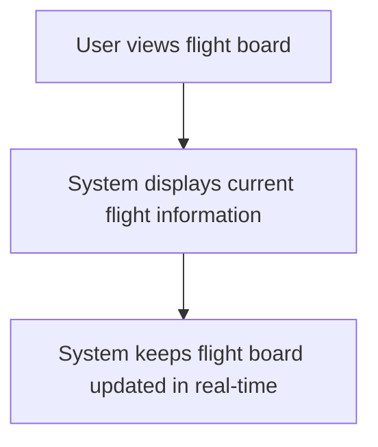
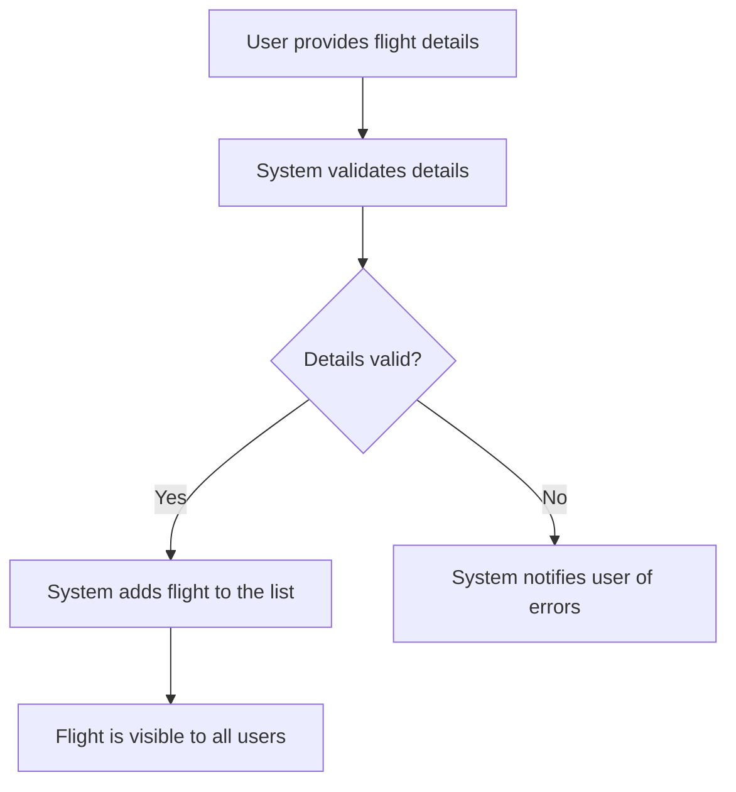
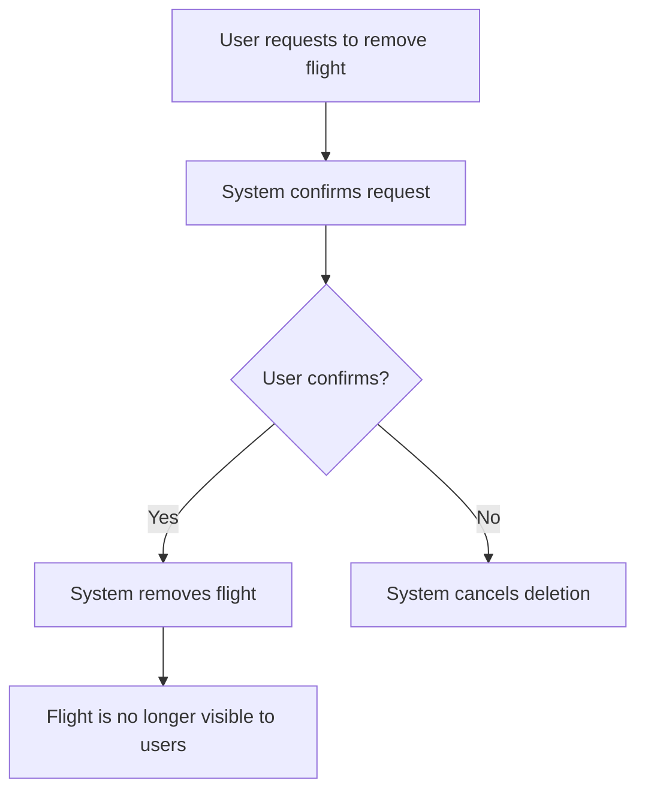
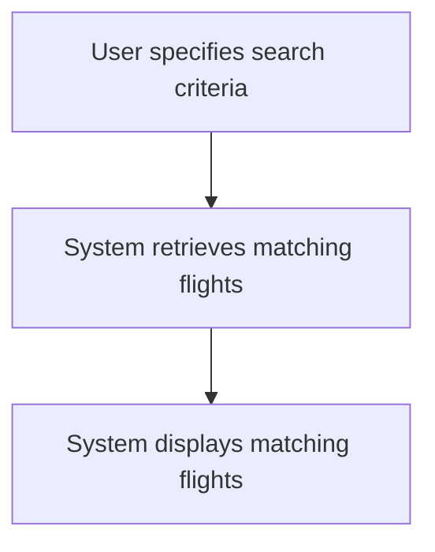
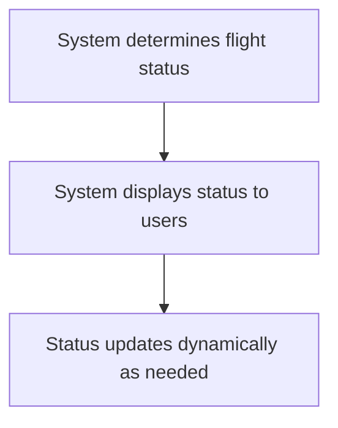

# Use Cases

## Identified Volatilities
1. **Real-Time Updates**: Changes in how real-time updates are handled (e.g., SignalR implementation).
2. **Flight Data Storage**: Potential changes in database technology or schema.
3. **Frontend Framework**: Updates to React or state management libraries.
4. **API Contracts**: Modifications to API endpoints or data structures.
5. **Validation Rules**: Changes in business rules for flight validation.

## Use Cases

### 1. Display Real-Time Flight Board
#### Flow
1. The user views the flight board to see the current status of flights.
2. The system ensures the flight board is always up-to-date with the latest information.

#### Mermaid Diagram

### 2. Add a New Flight
#### Flow
1. The user provides details for a new flight.
2. The system validates the provided details.
3. If valid, the system adds the flight to the list and ensures it is visible to all users.

#### Mermaid Diagram

### 3. Delete a Flight
#### Flow
1. The user requests to remove a flight.
2. The system confirms the request with the user.
3. If confirmed, the system removes the flight and ensures it is no longer visible to users.

#### Mermaid Diagram

### 4. Search and Filter Flights
#### Flow
1. The user specifies criteria to find specific flights.
2. The system retrieves and displays flights matching the criteria.

#### Mermaid Diagram

### 5. Calculate Flight Status
#### Flow
1. The system determines the current status of each flight based on predefined rules.
2. The system ensures the status is visible to users.

#### Mermaid Diagram

